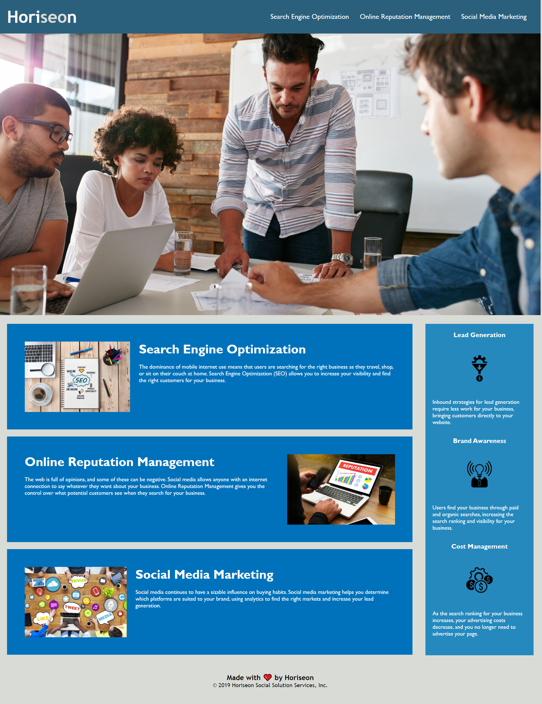

# WashU Bootcamp Homework, Week One

## Table of Contents

I. Description
II. Project screenshot
III. Link to deployed page

## I. Description

Week one homework.  
Refactoring the 'Horiseon' homepage to improve accessibility, and improve the readability of both the HTML and CSS files. Creating a repository on Github, and deploy the page to a live URL.

## II. Project screenshot

## III. Link to deployed page

https://mikechampion.github.io/01-git-html-css-02-Homework/
